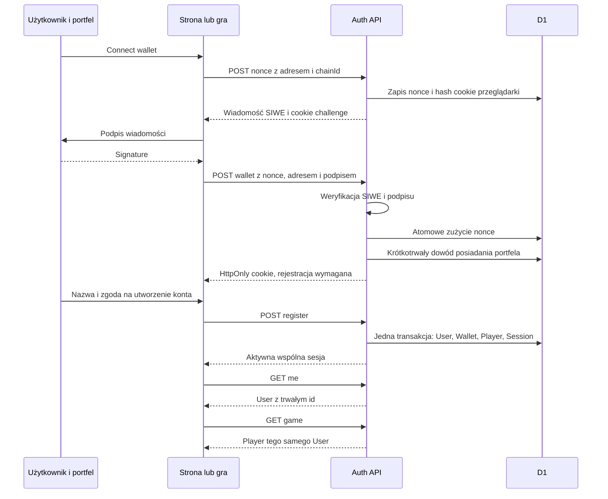
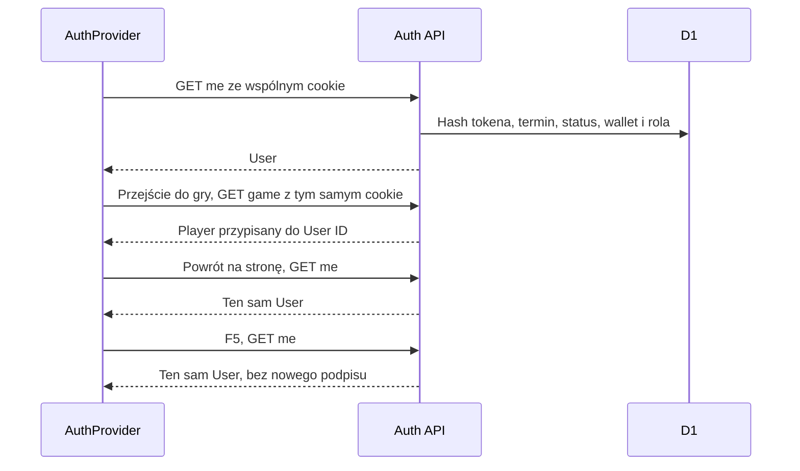

# Authentication Flow

Stan implementacji: 9 września 2026. Strona, `/game`, `/profile`, `/campaigns` i `/admin` korzystają z jednego AuthProvider i jednego API `/api/auth/*`. Gra nie ma osobnego logowania.

## NEW USER



Dowód przed rejestracją jest ważny przez 15 minut. Nie daje dostępu do gry, profilu, kampanii ani administracji. Formularz nie przyjmuje roli, identyfikatora konta ani adresu wskazanego przez klienta. Nowe konto otrzymuje USER. Email nie jest wymagany ani zbierany w tym przepływie.

## EXISTING USER

```mermaid
sequenceDiagram
    participant F as Strona lub gra
    participant W as Portfel
    participant A as Auth API
    participant D as D1
    F->>A: POST nonce
    A-->>F: SIWE, jednorazowy nonce
    F->>W: Prośba o podpis
    W-->>F: Signature
    F->>A: POST wallet
    A->>A: Sprawdzenie podpisu, domeny, sieci, czasu
    A->>D: Zużycie nonce i odczyt właściciela wallet
    A->>D: Nowa sesja; unieważnienie poprzedniej sesji konta
    A-->>F: Cookie HttpOnly
    F->>A: GET me
    A-->>F: Ten sam User ID i rola
    F->>A: GET game
    A-->>F: Istniejąca postać i postęp
```

Adres jest normalizowany do małych liter. `account_wallets.address` jest PK, a `account_wallets.user_id` ma UNIQUE i FK do konta. Jedno konto ma dokładnie jeden aktywny portfel. Nie ma automatycznego podpinania drugiego adresu po zmianie konta w MetaMask.

## ACTIVE SESSION: Landing → Game → Landing



Cookie ma `Path=/` i nie ma `Domain`: strona i gra działają na jednym originie. Nie rozszerzamy uprawnień cookie na subdomeny. Oddzielenie gry na inny origin wymaga nowego projektu bezpieczeństwa; samo ustawienie szerokiego Domain nie wystarczy.

## Sesja i wylogowanie

- Produkcyjne cookie: `__Host-tpu_session`, HttpOnly, Secure, SameSite=Lax, Path=/, Max-Age do 30 dni. Cookie challenge ma 5 minut.
- Serwer przechowuje SHA-256 losowego tokena 256-bitowego. Nie ma JWT ani refresh tokenów w localStorage.
- Pełna sesja serwerowa: ważność bez odnowienia 7 dni, limit bezwzględny 30 dni od podpisu.
- `POST /api/auth/refresh` przedłuża ważną sesję do maksymalnie 7 dni od teraz, nigdy poza limit 30 dni. Wygasła sesja wymaga podpisu.
- AuthProvider sprawdza sesję przy starcie, zmianie aktywnej karty, komunikacie między kartami i co 30 sekund w widocznej karcie. Co 5 minut odnawia aktywną sesję.
- Nowy podpis generuje nowy losowy token i zastępuje poprzednią sesję danego konta. Inne urządzenie zostanie wylogowane. Jest to świadomie model jednej aktywnej sesji na konto.
- `POST /api/auth/logout` usuwa sesję i cookie. BroadcastChannel oraz niesekretne zdarzenie storage powodują ponowne `/me` w pozostałych kartach.
- AuthGate usuwa chronione komponenty, dane profilu i stan gry; zmiana userId remountuje je pod nowym kluczem. Żądania starej gry są zatrzymywane podczas unmount.
- Disconnect wallet to oddzielna operacja. Nie udaje wylogowania z aplikacji.

## Portfel i sieć

`walletConnected`, `authenticated`, `initializing` i `networkVerified` są oddzielnymi stanami. Odczyt `eth_accounts` nigdy nie tworzy sesji.

Przed symulacją i wysłaniem transakcji serwis ponownie odczytuje `/me`, adres i chainId z providera. Zmieniony portfel albo sieć blokuje operację. Zmiana konfiguracji testnet → mainnet wymaga nowego podpisu; dla istniejącego portfela kontraktowego podpis musi zostać zaakceptowany również na poprzedniej sieci, żeby nowy kontroler tego samego adresu na innej sieci nie przejął starego konta.

Sieć i kontrakty ustawia `packages/blockchain/config.ts` na podstawie `BLOCKCHAIN_NETWORK`, adresów kontraktów i RPC. Prywatne RPC serwera nie są publikowane przez `/api/config`. WalletConnect używa `WALLETCONNECT_PROJECT_ID`; bez identyfikatora opcja QR nie jest pokazywana. Portfel przeglądarkowy i Base Account działają niezależnie od tej konfiguracji.

## Administrator

Administrator jest zwykłym kontem z rolą ADMIN lub SUPER_ADMIN w `registrations`. Każde żądanie `/api/admin` sprawdza tę rolę na serwerze. Nagłówki ChatGPT, email, numer pierwszego konta i role przesłane z klienta nie nadają uprawnień.

`AUTH_ADMIN_WALLET` to jawna konfiguracja początkowego administratora, kontrolowana przez właściciela wdrożenia. Wskazany adres nadal musi poprawnie podpisać SIWE. Nadanie jest rejestrowane w `admin_audit`. Po pierwszym poprawnym logowaniu należy usunąć zmienną i ponownie wdrożyć konfigurację; rola zostaje w bazie. Nie zostawiać bootstrap przy późniejszym odbieraniu tej roli.

## Migracja istniejących kont

`registrations` pozostaje tabelą User; nie wprowadzono drugiej tabeli użytkowników. Istniejące userId, nazwy i rekordy Player są zachowane. Stara tabela `wallets` jest wyłącznie historią wcześniejszych weryfikacji. Po pierwszym poprawnym podpisie najstarszy historyczny portfel zostaje przeniesiony do relacji `account_wallets`. Kolejne historyczne adresy nie mogą stworzyć kopii tego konta.

Kontrola istniejącej bazy wykazała jedno konto, jedną postać i jeden zweryfikowany adres, bez osieroconych postaci. Migracja 0005 dodaje rzeczywisty FK `players.user_id → registrations.user_id`, zachowując treść zapisów. Migracja danych portfela jest ograniczonym, idempotentnym działaniem po podpisie; nie wykonuje DDL w czasie żądania.

Prywatna brama Sites pozostaje przed aplikacją. Jej zalogowanie daje dostęp do prywatnej strony, ale **nie** loguje do gry. Publiczne udostępnienie Site jest osobną decyzją właściciela.

## Lokalne testy

```sh
npm ci
npm run auth:test
npm run game:test
npm run typecheck
npm run build
```

Testy API używają rzeczywistych podpisów ECDSA i SQLite z migracjami, bez środków na portfelach. Testy wallet adaptera emulują tylko komunikację EIP-1193.

`tests/e2e/auth.spec.ts` zawiera cztery scenariusze uruchamiane w desktopowym i mobilnym widoku. E2E wymaga oddzielnego lokalnego D1 ze wszystkimi migracjami oraz działającej aplikacji. Nie kierować go na bazę produkcyjną. Portfel testowy podpisuje prawdziwe wiadomości; nie omija `/nonce`, `/wallet`, sesji ani rejestracji. Przygotowane scenariusze nie zastępują testów MetaMask, Base Account i WalletConnect na rzeczywistych urządzeniach.

Po uruchomieniu lokalnego serwera na porcie 5173 i zastosowaniu migracji:

```sh
npx playwright install chromium
npm run auth:e2e
```

Dla innego lokalnego portu ustaw `E2E_BASE_URL`, np. `http://localhost:8787`. Konfiguracja celowo odrzuca hosty produkcyjne. Wyników E2E nie należy deklarować na podstawie samego typecheck.

### Odnowienie bez wyścigu cookie

Cookie sesji ma termin bezwzględny do 30 dni, ale backend odrzuca je już po 7 dniach bez odnowienia. Odnowienie zmienia wyłącznie termin w D1; nie wysyła ponownie Set-Cookie. Dzięki temu opóźniona odpowiedź refresh nie może nadpisać cookie po wylogowaniu lub podpisie innego konta. Termin absolutny liczy się od podpisu, również jeśli wybór nazwy zajął kilka minut.
