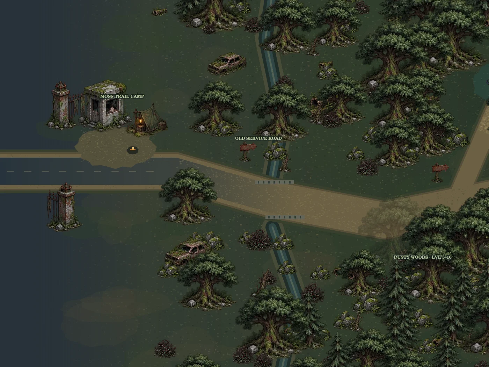
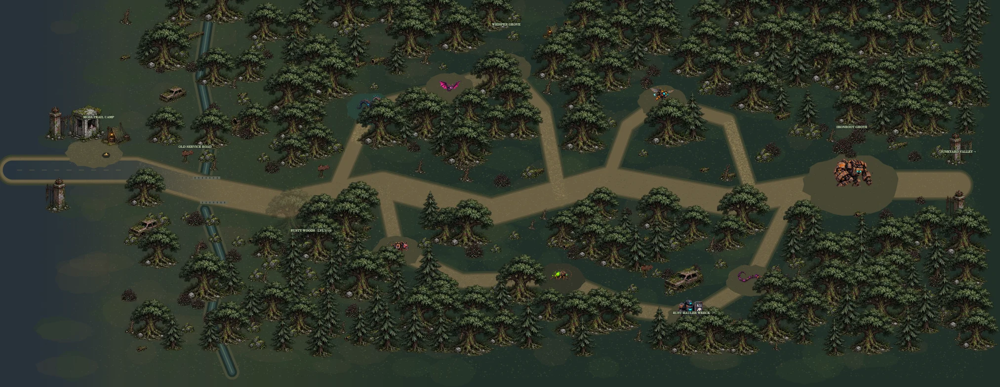
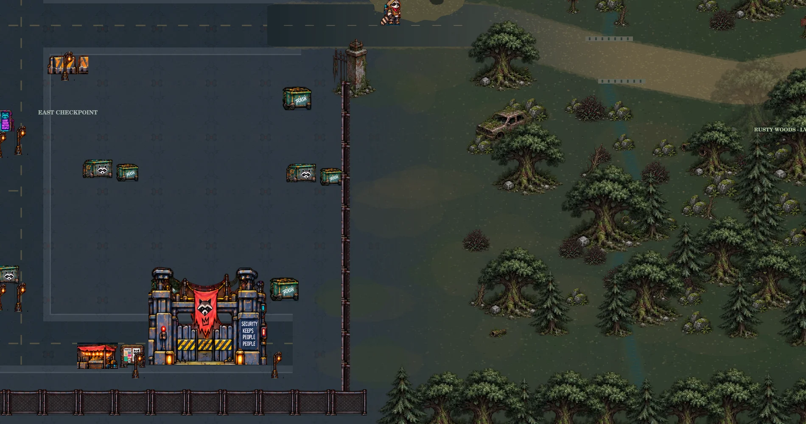

# Rusty Woods landscape expansion

The shared world is now 6200 × 1700 (formerly 3800 × 1700). The woodland region beyond x=2400 has 2.7 times its previous area. Trash Town's buildings, spawn and quest NPCs retain their positions.

The east gate opens onto Moss's camp and an abandoned service road. Worn asphalt blends into gravel over roughly 900 world units, crossing a shallow runoff culvert before the canopy thickens. Four connected trails lead to separate northern and southern encounter loops and the eastern Ironroot clearing. The Junkyard Valley gate remains a future-region marker, not a working region transfer.

Routes, prop footprints, foliage clearance and minimap geometry share `packages/game-core/woods-layout.ts`. Foliage is deterministic; trees and large props have authoritative collisions. Details outside the camera are culled. Crowns fade around the local player. Town neon props at the old forest landmark coordinates have been removed.

Existing nine enemy IDs, stats, quests, rewards and cooldowns remain. `seedWoods` moves saved enemies to their new homes once, without healing or reviving them. Stale navigation and windups are discarded. A player saved inside a new obstacle is moved to nearby free ground once without resetting progress.

## Review

- `npm run game:test`: includes connected trail clearance, interaction access and saved-world migration tests.
- `npm run typecheck` and `npm run build`.
- Canvas previews use the production woodland renderer and existing atlas art. They are not browser multiplayer screenshots.
- Optional recreation: install `@napi-rs/canvas` outside the project and set `CANVAS_MODULE` to its path, then run `node --import ./scripts/register-test-typescript.mjs scripts/preview-woods.mjs`.




## Deploy

In PowerShell, from the project directory:

```powershell
& {
    git pull --ff-only origin main
    if ($LASTEXITCODE -ne 0) { throw 'Nie udalo sie pobrac zmian.' }
    & .\scripts\deploy-testnet.ps1
}
```

Deploy both realtime and frontend workers: they must agree on world bounds and collisions. The script stops on any failed step. No database reset is required. This document does not indicate that a live deployment has occurred.

## Screenshot-driven boundary correction

Exterior camera bounds now keep the full viewport over terrain; very tall/wide viewports use a fitting minimum zoom. Pointer aim uses that same zoom. The east town fence blocks movement outside its gate. Players saved on the newly solid wall are moved to nearby free ground once (player woodsLayout 3); monster migration is unchanged.

The terrain no longer paints a perimeter road below the forest. Woodland ground fills the terrain to its edges, bordered by decorative foliage. The approach has no rounded road cap, trail outlines are removed, runoff has broken muddy banks, and encounter ground is blended rather than filled with one polygon. The future pass is explicitly marked closed.

The preview script now renders actual town terrain, buildings, NPCs and shared decor in addition to the forest, including a fourth south-wall view. This catches city/forest joins that forest-only previews missed. Camera bounds and wall collision have regression tests; previews remain Canvas renders, not browser screenshots.


